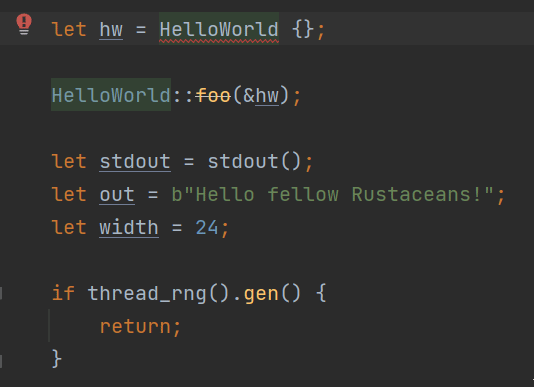
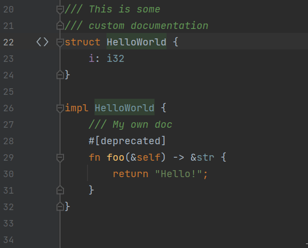
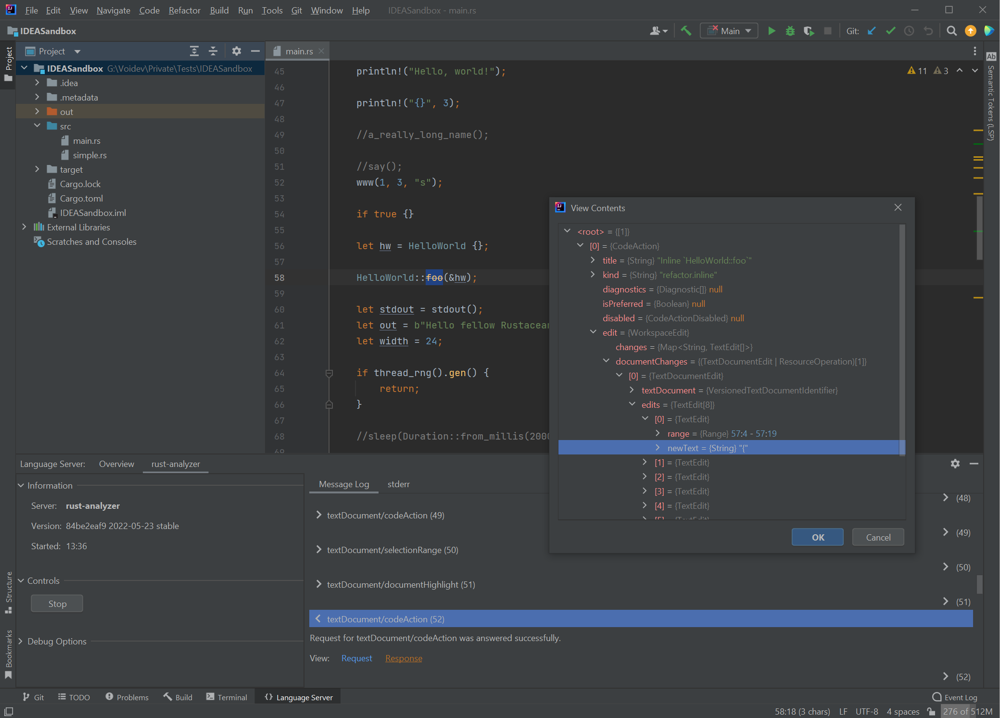

# LSP-IDEA

A Language Server Protocol client implementation for JetBrains IDEs.

## Bundled Servers

Some language servers require or benefit from special support by clients.
LSP-IDEA comes bundled with extensive rust-analyzer integration
and makes it easy for developers to implement new integrations
on top of the existing infrastructure (via extension points).

### rust-analyzer

- One-click installation of rust-analyzer executable (on Windows)
- Complete configuration UI
- Support for one-click running code through code lenses (e.g. green "Run" arrow next to main method)
- rust-analyzer-specific extensions to LSP

### other

- Any executable that supports stdin/stdout communication can be used as a language server

## Supported Features

- Syntax highlighting based on Semantic Tokens
- Code completion
- Go to definition/declaration
- Go to class/go to symbol
- Reformat file
- Find references
- Rename
- Extract variable/constant/function
- Expand/contract selection ((Shift+)Ctrl+W)
- Structure View (Ctrl+F12)
- Code Lenses
- Highlight usages
- Code Folding
- Diagnostics
- Quickfixes, code actions
- Move Item up/down
- Join Lines
- On Enter
- Progress reporting

## Debugger

One of LSP-IDEA's design goals is debuggability.
To that end,
it features multiple tool windows for inspecting
- JSON-RPC messages, including their contents and stacktraces;
- the language server's stderr;
- semantic tokens as decoded by LSP-IDEA, including highlighting selected tokens.

## Gallery

#### Diagnostics

---

#### Code Actions

---

#### Debug Menu

